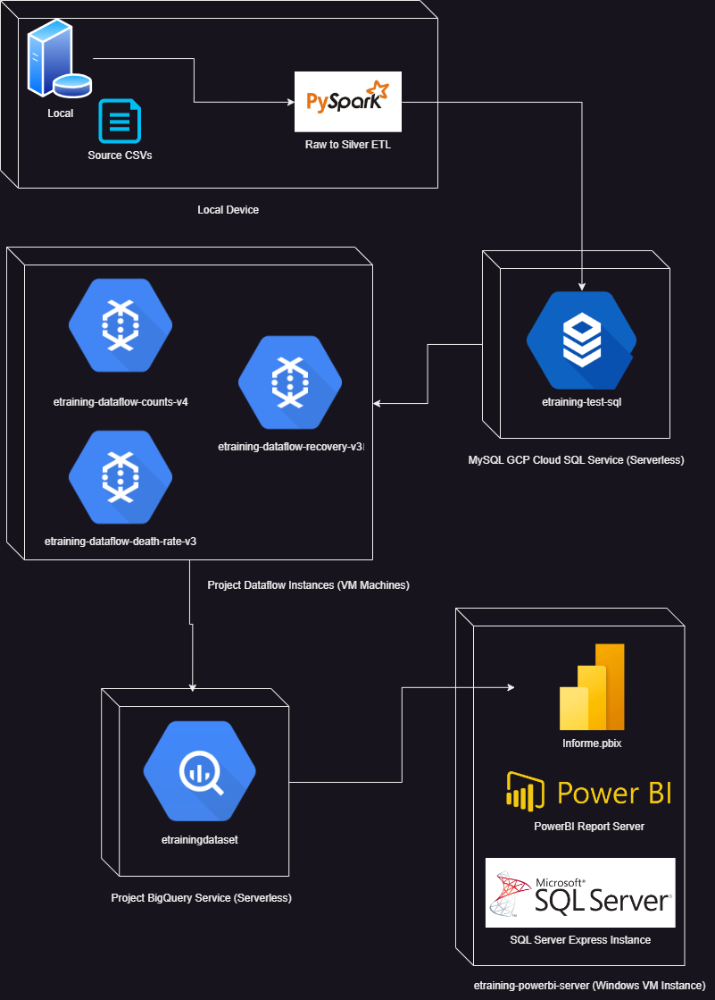
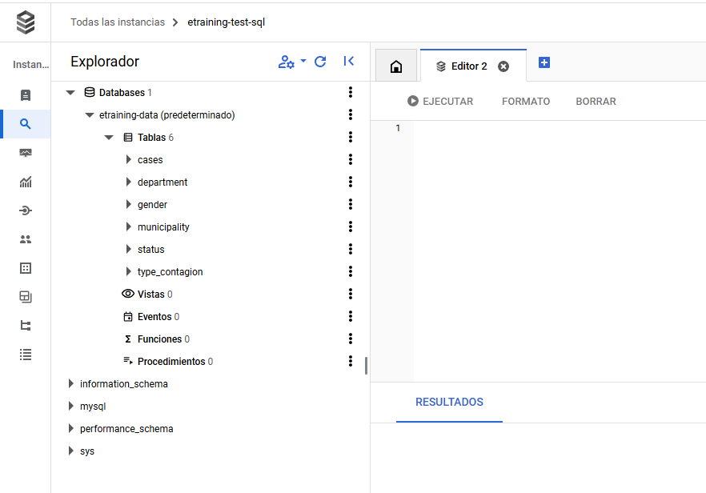
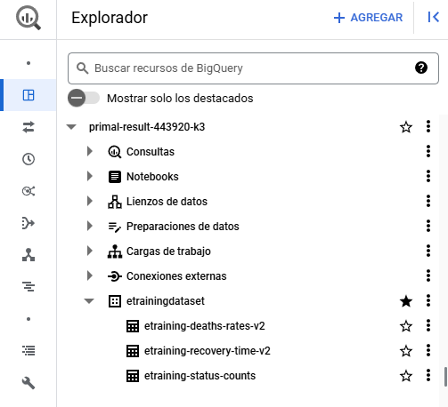
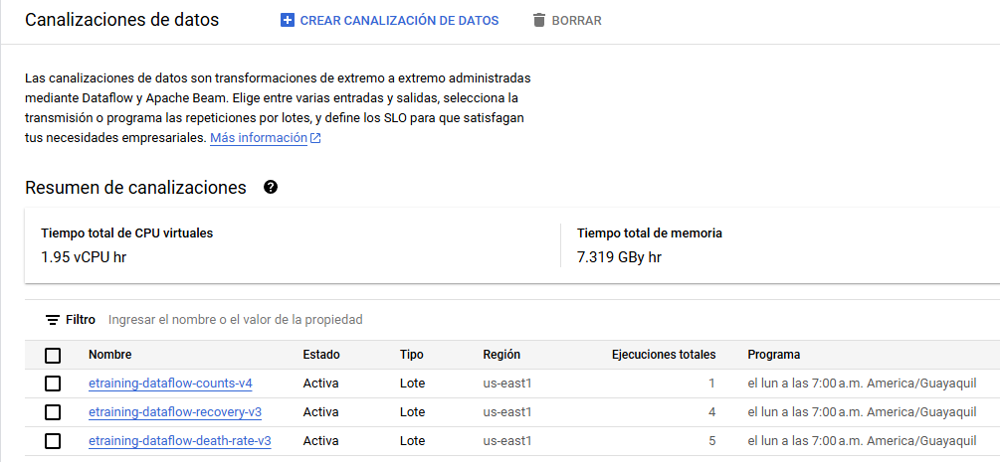
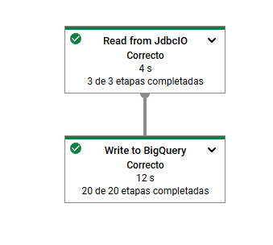

# E-training test
--- 
This project aims to create a full data flow where data is extracted and loaded from a set of CSV files to a GCP MySQL instance.

## Architecture
---
First of all, we will plan the architecture to follow for this project, as follows:



## Tools Installation
---

1. Install python3

```
sudo apt-get update
sudo apt-get install python3.6
sudo apt-get install software-properties-common
sudo add-apt-repository ppa:deadsnakes/ppa
sudo apt-get update
sudo apt-get install python3.8
sudo dnf install python3
```

2. Apache Spark & PySpark

Create a dataflow by means of PySpark, which allows us to run efficient and reliable ETLs by means of Python, making us able to consume and load from and to different source types, among them, CSV files and MySQL databases. 

```
sudo apt update
sudo apt install curl mlocate git scala -y
curl -O https://archive.apache.org/dist/spark/spark-3.2.0/spark-3.2.0-bin-hadoop3.2.tgz
sudo tar xvf spark-3.2.0-bin-hadoop3.2.tgz
sudo mkdir /opt/spark
sudo mv spark-3.2.0-bin-hadoop3.2/* /opt/spark
sudo chmod -R 777 /opt/spark
```

In order to be able to execute Apache Spark commands, we'll have to add certain binaries to the PATH environment variable

```
sudo vim ~/.bashrc
```

Write the following lines, then save and exit
```
export SPARK_HOME=/opt/spark
export PATH=$PATH:$SPARK_HOME/bin:$SPARK_HOME/sbin
```

Then run this command to bring changes into effect

```
source ~/.bashrc
```

3. Install additional Python libraries

`pip install dotenv`

4. Data files

All CSVs provided for this exercise are saved in the **./Data** folder.

5. Configure credentials

The target instance is hosted as a GCP's Cloud SQL Service and is configured as a MySQL database, credentials must be provided via the following environment variables:

```
MYSQL_USERNAME=
MYSQL_PASSWORD=
MYSQL_HOST=
MYSQL_PORT=
MYSQL_DATABASE=
```

6. Other project components were created using the GCP Cloud Console, as documented before

## Cloud Components Creation

The first step was to create a Cloud SQL Server MySQL instance, the final result is shown below:



This instance is running at 34.95.234.233:3306

The SQL code that was used to create the full schema of this database instance can be found at ./ETL/SQL/create_database_schema.sql.

In order to run the ETL process, we can use the `spark-submit ETL/raw_to_silver.py` command to submit a job that will populate an already created database.

Having run the initial ETL (executed locally), the next step is to create a Big Query instance, which will act as the final consumption zone for reports and data analysts. Here is the final result:



A dataset that contains three final tables was created. These tables are fed by three dataflow pipelines. Each of these dataflow pipelines perform a SQL query over the initial Cloud SQL Service and load the results to Big QUery. 
Each ETL run overwrites data in the final consumption tables. All of them are scheduled to be run each Monday at 7:00 am (GMT-5:00)
Each SQL query performed by dataflows pipelines can be found at ./ETL/SQL



The figure below shows an example of a successfull execution of a job forked from a pipeline


Finally, a Windows VM was provisioned to show the final report by means of a Report Server service available publicy without need of AD authentication (as PowerBI Service would require).


Thorugh a RDP connection additional Software components were installed (SQL Server Express and Report Server itself). The final result can be found at: **[Informe](http://34.30.14.46/Reports/powerbi/Informe)**
